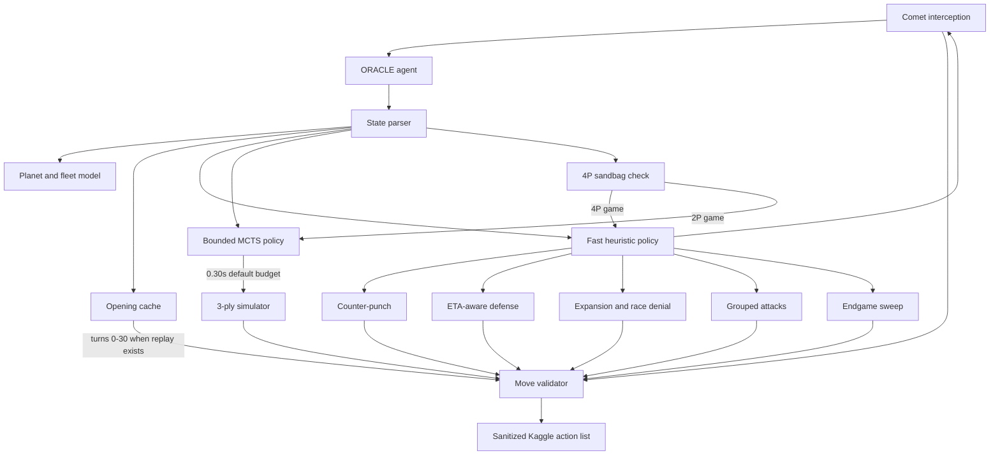
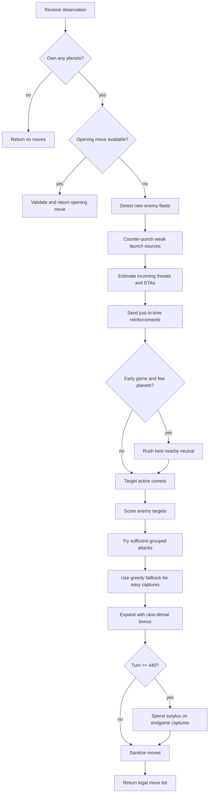

# ORACLE - Orbit Wars Agent

ORACLE is a self-contained Kaggle Orbit Wars bot. The default submitted policy uses bounded MCTS over full-turn heuristic plans for 2-player positions, while 4-player games use an FFA-aware heuristic with defensive sandbagging when ORACLE is leading too hard.

## Strategy

- **Counter-punch:** detects large new enemy launches and attacks weakened source planets.
- **ETA-aware defense:** estimates incoming fleet arrival and local production before deciding whether to reinforce.
- **Race denial:** prioritizes neutral planets the enemy can contest soon.
- **Grouped attacks:** tries multi-source target grouping, but only commits when the ships launched now are sufficient.
- **Greedy fallback:** preserves easy tactical captures when synchronization is not available.
- **Endgame sweep:** spends late surplus ships on captures that can land before the final turn.
- **Per-turn intercept cache:** reuses repeated orbit/intercept calculations inside each decision.
- **4P sandbagging:** suppresses expansion and attacks when our ship share is too high in free-for-all games.
- **Comet interception:** targets active visible comets using legal `comets.paths` data and reserves ships near spawn windows.

## Architecture



The default 2-player submission path is `State parser -> Bounded MCTS policy -> Move validator`. In 4-player games, ORACLE uses the FFA-aware heuristic directly; if its ship share is too high, sandbagging suppresses expansion and attacks.

## Turn Flow



## Local Results

Fixed-seed benchmark against the previous baseline copy:

```text
Seeds 0..39:
candidate vs starter: 27W/13L = 67.5%
candidate vs random: 10W/0L = 100.0%
candidate vs baseline: 29W/11L = 72.5%

Seeds 40..69:
candidate vs starter: 25W/5L = 83.3%
candidate vs random: 10W/0L = 100.0%
candidate vs baseline: 26W/4L = 86.7%
```

These are local measurements and should not be treated as guaranteed leaderboard ELO.

## Files

```text
main.py          # Kaggle submission agent
arena_oracle.py  # Local Elo-style 2P/4P arena
eval_oracle.py   # Fixed-seed evaluator
tune_oracle.py   # Deterministic random parameter tuner
test_agent.py    # Quick smoke test against built-in bots
replays/         # Optional opening-book replay inputs; JSON replays are ignored by default
requirements.txt
LICENSE
```

## Quick Start

```bash
pip install -r requirements.txt
python test_agent.py
```

## Reproducible Evaluation

```bash
python eval_oracle.py --agent main.py --games 40
python arena_oracle.py --agents main.py starter starter starter --players 4 --games 40 --shuffle
python tune_oracle.py --iterations 30 --games 30
```

The tuner forces `use_mcts=False` so the exposed heuristic parameters are what it actually optimizes. Re-test accepted parameter sets with `eval_oracle.py` before changing submission defaults.

## Opening Book Replays

`main.py` can load replay JSON files from `replays/` when available. The directory is tracked with `.gitkeep`, but replay JSON files are ignored by default because they can be large and environment-specific. The agent runs normally without replays.

## Submit to Kaggle

The source of truth is `oracle-orbit-wars/main.py`. Submission zip files are not
committed to the repository; generate one locally only when Kaggle requires a
packaged upload:

```bash
zip -j /tmp/oracle_submission.zip oracle-orbit-wars/main.py
kaggle competitions submit orbit-wars -f /tmp/oracle_submission.zip -m "ORACLE optimized heuristic"
```
