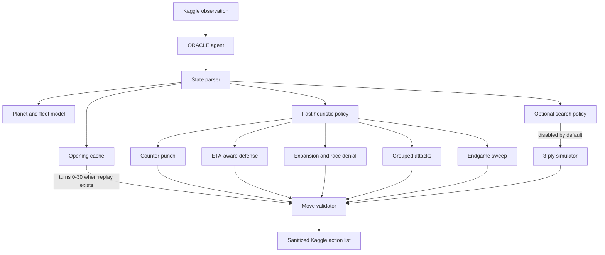
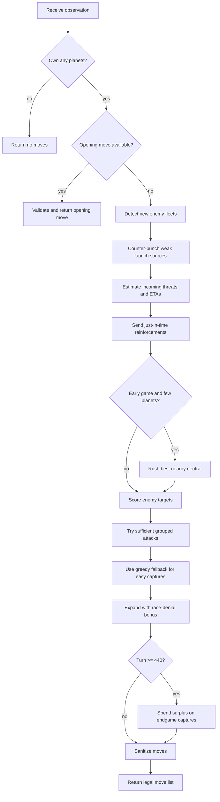

# ORACLE - Orbit Wars Agent

ORACLE is a self-contained Kaggle Orbit Wars bot. The default submitted policy is a fast heuristic engine; experimental MCTS code remains in `main.py`, but it is disabled unless `config["use_mcts"]` is explicitly set to `True`.

## Strategy

- **Counter-punch:** detects large new enemy launches and attacks weakened source planets.
- **ETA-aware defense:** estimates incoming fleet arrival and local production before deciding whether to reinforce.
- **Race denial:** prioritizes neutral planets the enemy can contest soon.
- **Grouped attacks:** tries multi-source target grouping, but only commits when the ships launched now are sufficient.
- **Greedy fallback:** preserves easy tactical captures when synchronization is not available.
- **Endgame sweep:** spends late surplus ships on captures that can land before the final turn.

## Architecture



The default submission path is `State parser -> Fast heuristic policy -> Move validator`. Search is kept for experiments only because the heuristic path is faster and more stable under Kaggle's turn budget.

## Turn Flow



## Local Results

Fixed-seed benchmark against the previous baseline copy:

```text
Seeds 0..39:
candidate vs starter: 27W/13L = 67.5%
candidate vs random: 10W/0L = 100.0%
candidate vs baseline: 29W/11L = 72.5%

Seeds 40..69:
candidate vs starter: 25W/5L = 83.3%
candidate vs random: 10W/0L = 100.0%
candidate vs baseline: 26W/4L = 86.7%
```

These are local measurements and should not be treated as guaranteed leaderboard ELO.

## Files

```text
main.py          # Kaggle submission agent
eval_oracle.py   # Fixed-seed evaluator
tune_oracle.py   # Deterministic random parameter tuner
test_agent.py    # Quick smoke test against built-in bots
requirements.txt
LICENSE
```

## Quick Start

```bash
pip install -r requirements.txt
python test_agent.py
```

## Reproducible Evaluation

```bash
python eval_oracle.py --agent main.py --games 40
python tune_oracle.py --iterations 30 --games 30
```

## Submit to Kaggle

From the repository root:

```bash
zip -j ORACLE_1700_SUBMISSION.zip oracle-orbit-wars/main.py
kaggle competitions submit orbit-wars -f ORACLE_1700_SUBMISSION.zip -m "ORACLE optimized heuristic"
```
